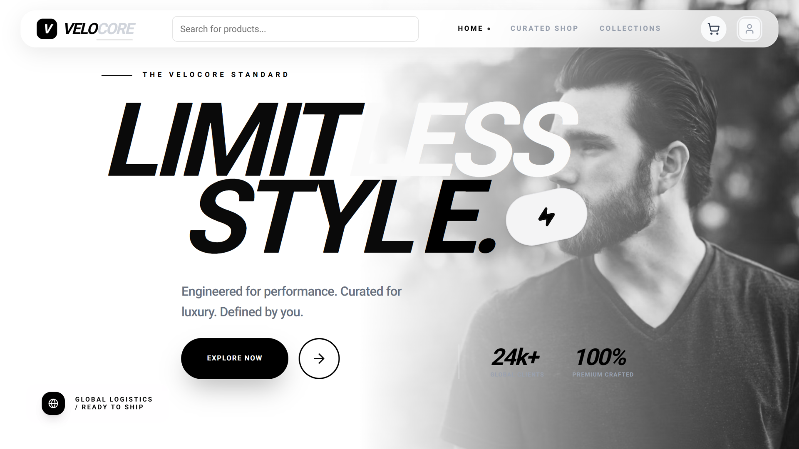
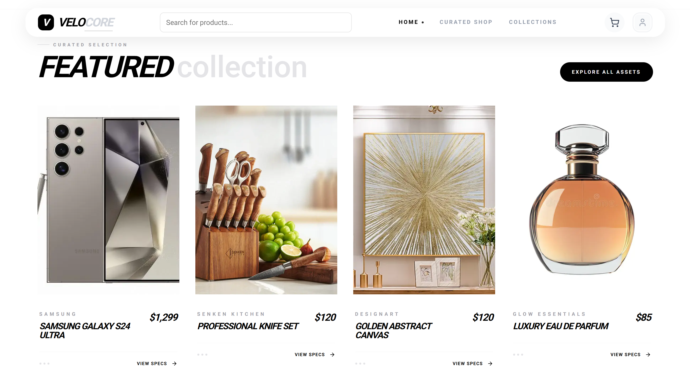
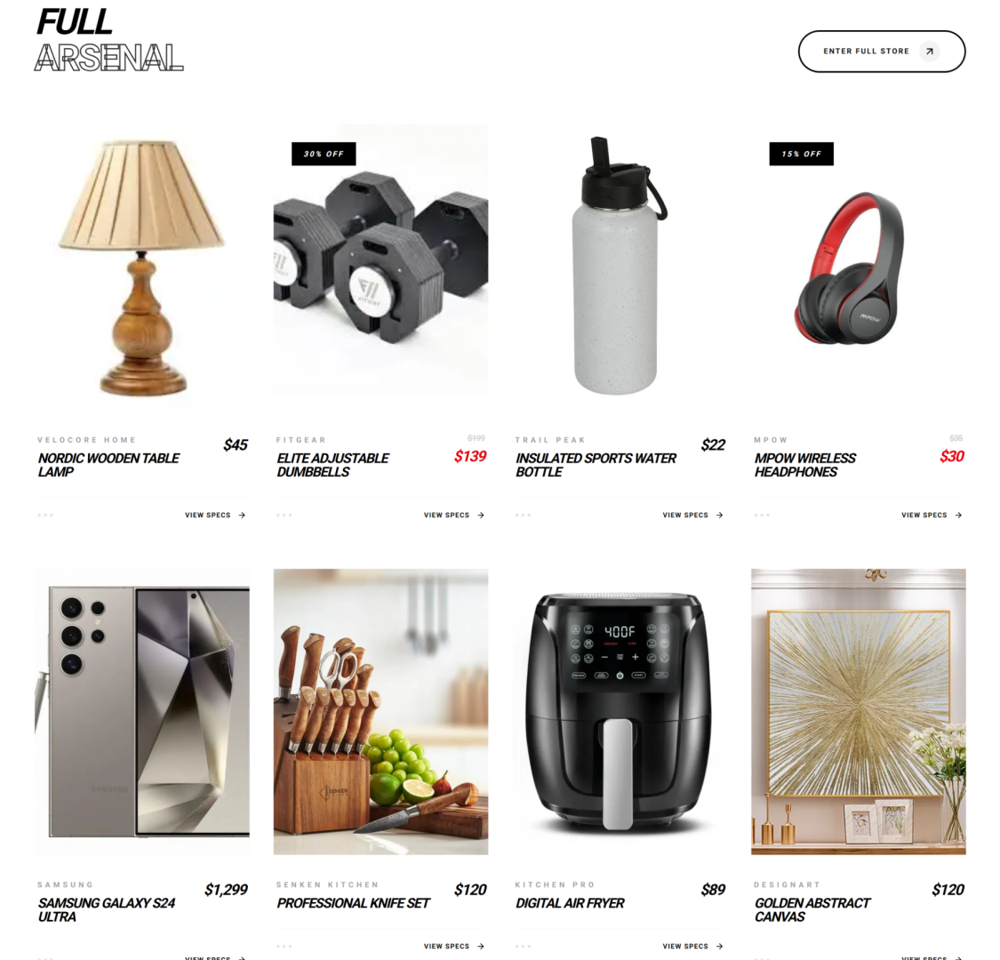
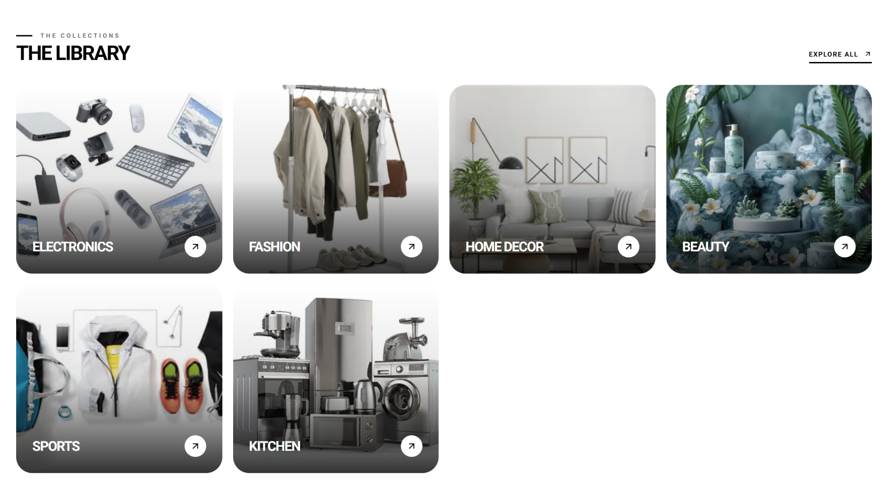
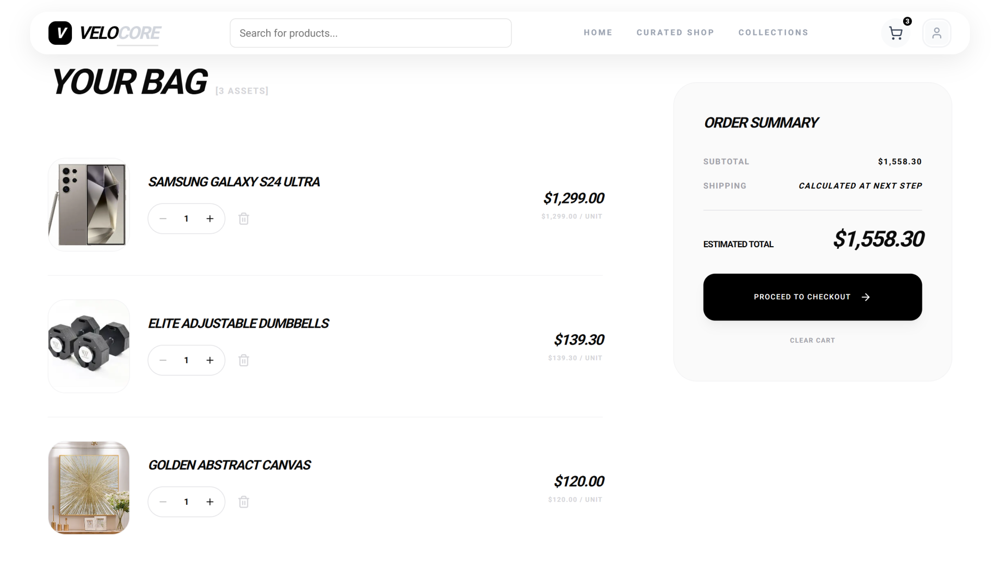
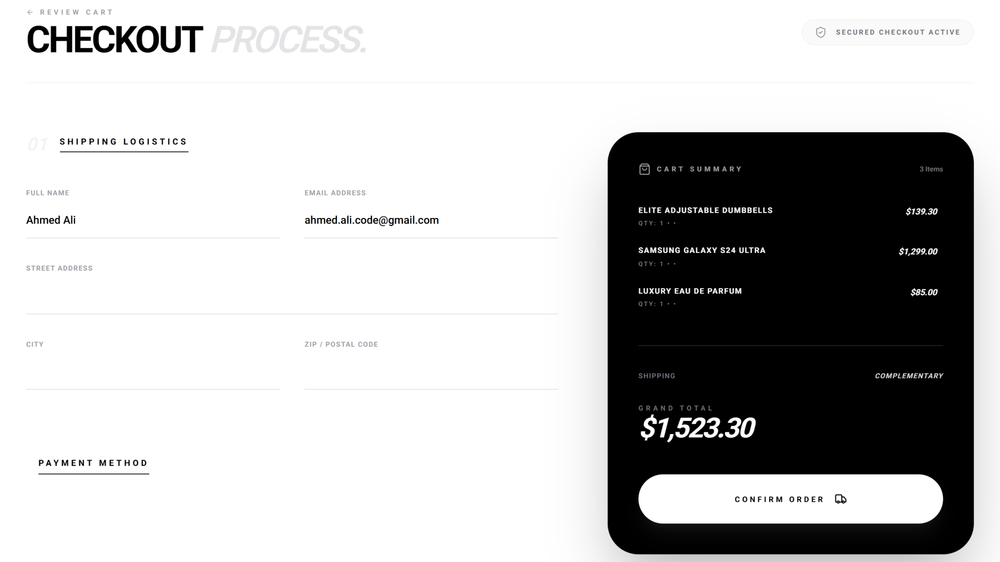
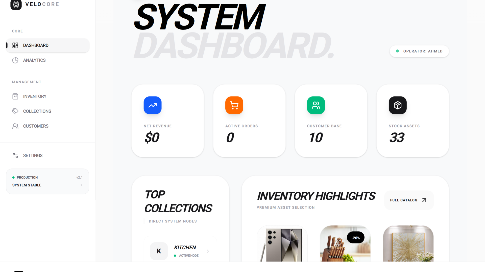

# 🛒 E-Commerce Frontend

A production-ready **E-Commerce Frontend application** built with **Next.js**, focused on performance, scalability, and real-world shopping flows.

This project delivers a complete customer experience — from browsing products to secure checkout — with a clean UI and responsive design.

The frontend integrates with a **custom RESTful backend API** handling authentication, products, cart, orders, and checkout logic.

---

## 🌐 Live Demo

👉 https://ecommerce-frontend-alpha-gray.vercel.app/

---

## ✨ Project Highlights

- Production-style frontend architecture
- Optimized UI/UX for conversion-focused flows
- Clean separation of components and business logic
- Built to integrate seamlessly with a scalable backend

---

## 🖼️ Screenshots

### 🏠 Homepage – Hero Section


---

### ⭐ Featured Products


---

### 🛍️ All Products


---

### 🗂️ Categories


---

### 🛒 Cart


---

### 💳 Checkout


---

### 📊 Admin Dashboard – Overview


---

## 🚀 Features

- Modern, responsive UI built with **Next.js**
- Product listing, filtering, and product details
- Shopping cart with real-time updates
- Secure checkout flow
- Authentication & protected routes
- REST API integration for dynamic data
- Fully responsive across Desktop, Tablet, and Mobile

---

## 🧰 Tech Stack

- **Next.js**
- **React**
- **TypeScript**
- **Tailwind CSS**
- **RESTful APIs**

---

## ⚙️ Environment Variables

This project uses a **`.env.local`** file for configuration.

### 📄 `.env.local` example

Create a file named `.env.local` in the project root:

```env
NEXT_PUBLIC_API_URL=http://localhost:5000
