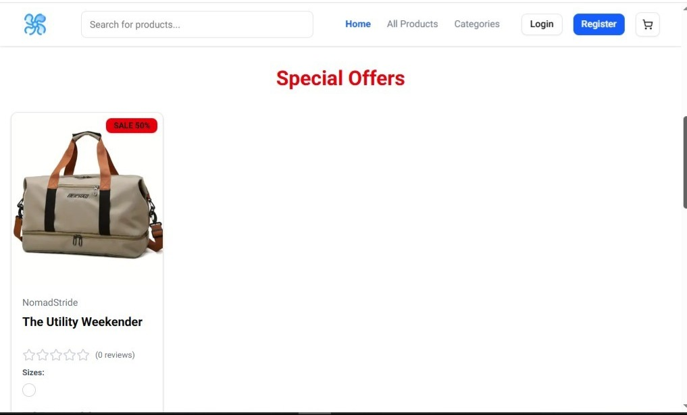
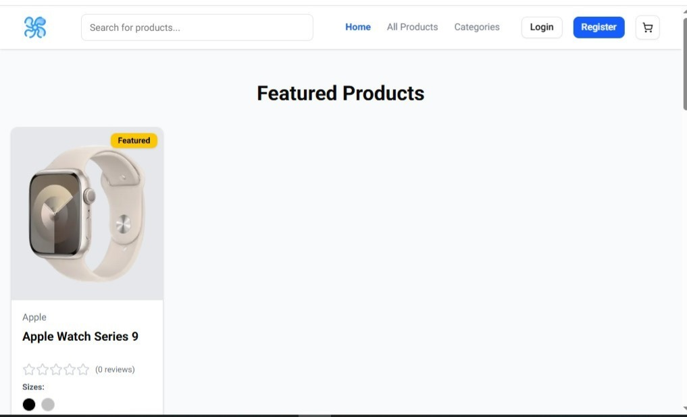
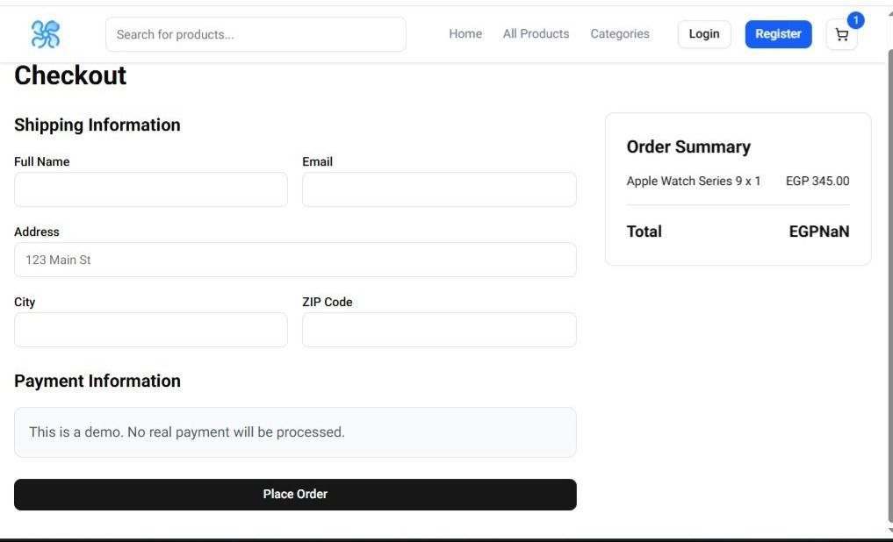
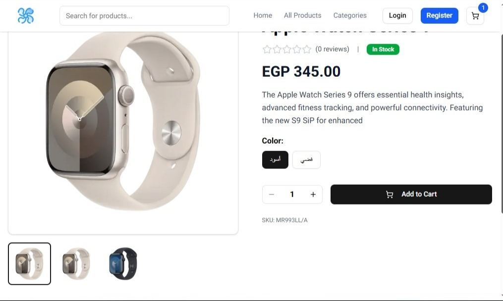

# 🛒 E-Commerce Frontend

A modern, responsive **E-Commerce Frontend application** built with **Next.js**.  
Designed to deliver a smooth shopping experience with clean UI, scalable structure, and real-world business flows.

The application consumes a **custom backend API** for authentication, products, cart, orders, and checkout.

---

## 🌐 Live Demo

👉 https://ecommerce-frontend-alpha-gray.vercel.app/

---

## 🖼️ Screenshots

### 🖥️ Desktop Showcase (Home Page)
<p align="center">
  
</p>

---

### 🛍️ Shopping Experience

| 📋 Product Listing | 🔍 Product Details |
|:---:|:---:|
|  |  |

| 🛒 Checkout & Cart | 📱 Product Preview |
|:---:|:---:|
|  |  |

---

## 🚀 Features

- Clean, modern UI built with **Next.js**
- Product listing & product details pages
- Shopping cart & checkout flow
- Authentication & protected routes
- Integration with a custom **REST API**
- Fully responsive (Desktop, Tablet & Mobile)

---

## 🧰 Tech Stack

- **Next.js**
- **React**
- **JavaScript**
- **Tailwind CSS**
- REST API Integration

---

## ⚙️ Environment Variables

This project uses a **`.env.local`** file.

### 📄 `.env.local` example

Create a file named `.env.local` in the project root:

```env
NEXT_PUBLIC_API_URL=http://localhost:5000
